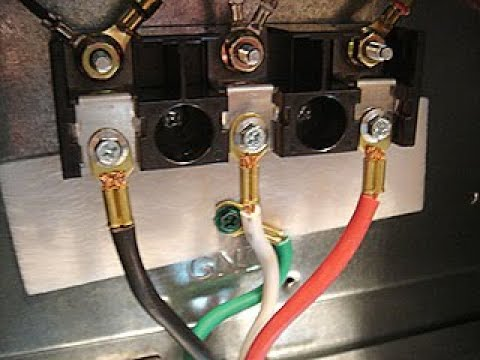
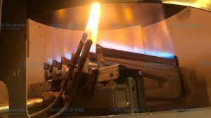

# INVESTIGACION UNIDAD 1
## Paradigma de la programacion orientada a objetos

###### Un *paradigma* se define como una forma de hacer las cosas; particularmente en programación, se entiende como paradigma a la metodología que sigue el programador a la hora de programar. La integran aspectos fundamentales como la lógica y la secuencia. Entre los paradigmas de programación más populares se encuentran la programación orientada a objetos y la programación estructurada.

###### La *programación orientada a objetos* busca modelar el concepto de objetos en la vida  real, creando así una familiaridad para el programador al momento de hacer la parte analítica de su programa. En POO hay ciertos conceptos fundamentales como lo son clase, objetos y de este último, atributos y métodos. Una clase puede entenderse como una fábrica de objetos. Mientras que un objeto es una entidad que mantiene atributos (características que lo componen) y métodos (que funcionalidad tiene). Los objetos tienen un estado, esto está relacionado con los últimos dos conceptos, como se aprecia en las siguiente imágen.

###### Además de esto, los conceptos como herencia, polimorfismo, encapsulamiento, abstracción y modularidad son también parte integral de este paradigma.
###### En los años 60, los investigadores noruegos Quisten Negar y Ole-Johan Del, desarrollaron la base de la programación orientada a objetos, creando el lenguaje Simula. Las nociones básicas de la POO como las clases, la herencia, y demás elementos fundamentales fueron creados en este lenguaje para permitir la automatización de procesos industriales. Simula-67 había hecho posible el que se considera el primer lenguaje orientado a objetos Smalltalk (1972), y más adelante daría pie al desarrollo de  C++, Java y C# entre otros.

###### La *abstracción* puede definirse como el concepto de reducir la complejidad en el código. Se considera fundamental debido a su utilidad: el reducir la complejidad de los algoritmos o centrarse en uno independiente a los demás agiliza la programación y la hace más eficiente.

###### El *encapsulamiento* en programación consiste en “cubrir” el funcionamiento interno de una entidad para que esta no sea vulnerable a modificaciones directas. Se puede apreciar un ejemplo en la siguiente imagen.

###### Una persona para cocinar usando una estufa solo necesita utilizar los botones que hay, sin embargo, estos botones tienen  un cableado complejo que permite la funcionalidad de la misma, justo como se aprecia en las ultimas ds imagenes. El encapsulamiento es importante para evitar el mal manejo de los datos, el cambio de los estados de los objetos de manera inadecuada y el manejo poco solido del software.

###### Por otro lado, este es un calentador de paso que hay que hacer funcionar interactuando directamente con los componentes, extremando los riesgos.
###### En programación la herencia puede entenderse como la extensión de los atributos y/o métodos de una clase padre que se atribuyen también a la clase hijo. Se aprecia en la siguiente imagen:

###### En este caso, un coche comparte con una motocicleta el hecho de ser un medio de transporte (vehículo). Es por eso que ambas heredan los atributos de la clase vehiculo y a su vez tienen los propios.

## UML: Diagrama de clases
###### El lenguaje UML tuvo sus inicios en 1994, cuando Rumbaugh se unió a la compañía Rational fundada por Booch, con el proposito era unificar dos métodos que habían desarrollado: el método Booch y el OMT (Object Modelling Tool). Apareciendo el primer borrador en octubre de 1995. En esa misma época Jacobson, otro investigador, se unió a Rational y se incluyeron ideas suyas. Además, este lenguaje se abrió a la colaboración de otras empresas para que aportaran sus ideas. Todas estas colaboraciones condujeron a la definición de la primera versión de UML. 
###### La planificación y análisis que ofrece el desarrollo con UML es usado para sistemas con altos niveles de complejidad en la estructura y comportamiento. Es por esto mismo que las grandes empresas siguen utilizando el lenguaje unificado de modelado actualmente y sigue teniendo relevancia.
###### En 1997 UML 1.1 fue aprobada por la OMG convirtiéndose en la notación estándar de facto para el análisis y el diseño orientado a objetos.
###### UML se nutrio a partir de UML 1.1. Aunque UML 2.1 nunca fue lanzado como una especificación formal, las versiones 2.1.1 y 2.1.2, aparecieron en 2007, seguidas por UML 2.2 en febrero de 2009. UML 2.3 fue lanzado oficialmente en mayo de 2010. UML 2.4.1 fue lanzado oficialmente en agosto de 2011. UML 2, y por ultimo 5.1 fue lanzado en octubre de 2012 como una versión "En proceso" que fue formalmente liberada en junio de 2015.
### Diagrama UML: Maquina de dulces
###### El siguiente diagrama UML representa a una maquina de dulces clasica como la que se muestra e la siguiente imagen.

#### Elementos:
##### 1. **MaquinaDeDulces**:
###### La clase MaquinaDeDulces guarda una relacion de composicion con las clases ContenedorDulces, Almacenamiento y Dispensador, ademas de una relacion de uno a uno con la clase pago, ya que una maquina (en este caso la unica) puede realizar solo un metodo de pago.
##### 2. **ContenedorDulces**:
###### La clase ContenedorDulces representa al contenedor de dulces de la maquina y guarda una relacion de 1 a 50 con la clase ContenidoDulce, ya que un contenedor puede almacenar un maximo de 50 dulces.
##### 3. **Almacen**:
###### La clase Almacen representa al almacen donde se guardan las monedas ingresadas cuando se compran dulces de la maquina, contiene el metodo Almacenamiento, el cual comprueba si hay espacio para mas monedas y si es asi, pasar las monedas al almacenamiento. Guarda una relacion de composicion con la clase Dispensador ya que estan conectados.
##### 4. **Dispensador**:
###### La clase Dispensador tiene relaciones de composicion con las clases Almacen, Receptor de pago y llave, ya que son parte del mismo. De agregacion con la clase DispensadorCambioDulces, ya que es parte de pero no lo compone, ademas de una relacion de uno a uno con la clase Pago, es decir, un dispensador puede realizar un pago a la vez. Ademas de esto, contiene un metodo efectuar pago, que tiene un tipo de dato booleano; tomara un valor de true cuando se ingresen las monedas suficientes y efectuara los metodos de la clase DispensadorCambioDulces.
##### 5. **Pago**:
###### La clase pago  tiene una relacion con la clase MaquinaDeDulces de uno a uno, ya que a traves de la maquina de dulces se puede efectuar un solo metodo de pago, ademas de tener la isma relacion con la clase dispensador y un metodo llamdo conteo, el cual ira llevado el conteo de la monedas ingresadas. 
##### 6. **DispensadorCambioDulces**:
###### La clase DispensadorCambioDulces es una agregacion a la clase Dispensador, y tiene los metodos SoltarCambio y SolarDulce, que se ejecuan una vez se confirma que el ago esta completo en la clase Dispensador.
##### 7. **ReceptorCambio**:
###### La clase ReceptorCambio es un composicion del dispensador y tiene los metodos RecibirMoneda y DepositoMoneda, ambos de tipo entero. El metodo RecibirMoneda representa la accion de meter la moneda y el DepositoMoneda se activa una vez la clase Llave activa su metodo, con la cual tambien guarda una relacion de composicion.
##### 8. **Llave**:
###### La clase Llave tiene una relacion de composicion con la clase Dispensador y la clase ReceptorPago, ademas de un metodo de tipo booleano llamado Girar. Este metodo al tener un valor de true representa el giro de la llave que permite depositar la moneda por medio del metodo DepositoMoneda de la clase ReceptorPago.